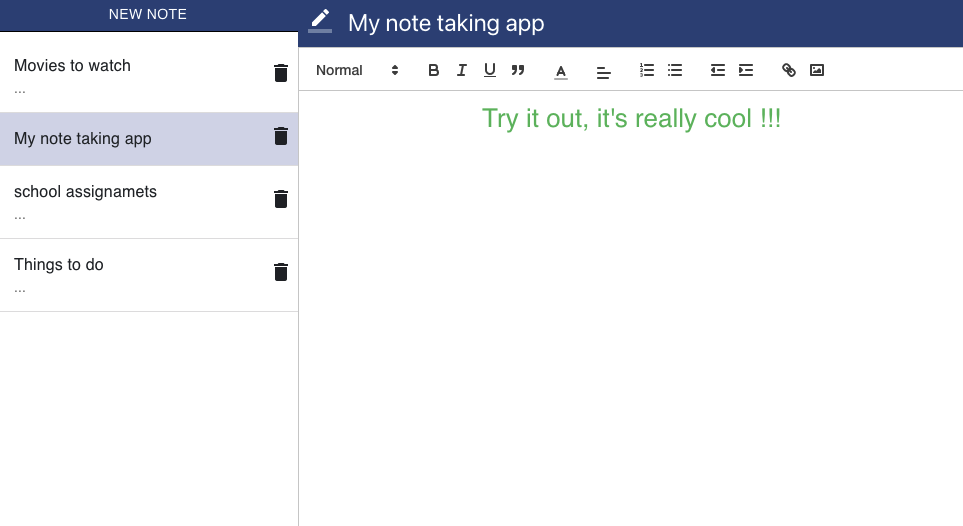

# Creating a Text Editor MintBean hackathlon Assignment

This project is the response [Mintbean's create a text editor hackathlon](https://www.mintbean.io/meets/817b12c6-cd0a-42a5-bac6-6d6311be7327).

## Screenshot

  

## Live Version

  A live version of the project can be found [here](https://my-notetaking-app.netlify.app/)

## About the Project

 - Users can create an account, and access their app from a minimalistic dashboard.
 - New notes can be created , and they will be stored in a database. 
 - A given user can login frm anywhere and access his/her's notes.

## Technologies used

 -   It was made with React and Firebase.

 ## known bugs / features yet to be implemented

  - to go back to the dashboard just hit back on the browser, I will add a user navBar in the near future. 

## Available Scripts

In the project directory, you can run:

### `yarn start`

Runs the app in the development mode.\
Open [http://localhost:3000](http://localhost:3000) to view it in the browser.

The page will reload if you make edits.\
You will also see any lint errors in the console.

### `yarn build`

Builds the app for production to the `build` folder.\
It correctly bundles React in production mode and optimizes the build for the best performance.

The build is minified and the filenames include the hashes.\
Your app is ready to be deployed!

See the section about [deployment](https://facebook.github.io/create-react-app/docs/deployment) for more information.

## special mentions 

[WebDevSimplified](https://www.youtube.com/channel/UCFbNIlppjAuEX4znoulh0Cw) and [PortEXE](https://www.youtube.com/channel/UCjGQyJCSU_VVMTu5nigonqg) youtube tutorials helped me a lot to understand concepts needed for this project. 